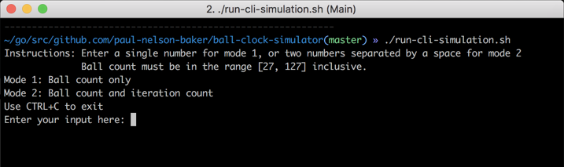
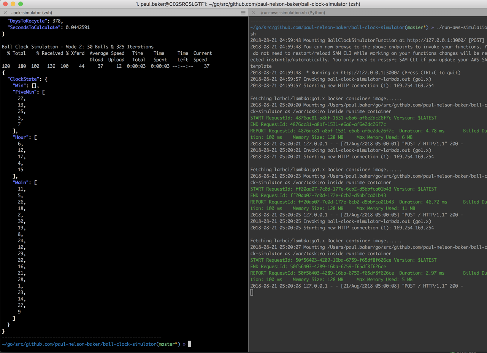

# Ball Clock Simulator
For requirements refer to the [PDF](Rakuten-BallClockAssignment.pdf). I had never heard of a Ball Clock before this, I found [this video](https://youtu.be/F7K6GIBWPQw) helpful to understanding what a Ball Clock was and how it worked.

## Executing the main application
There are two things that can be done.
- Unit Tests can be executed
- The Console application can be run

To do either of these things, respectfully, you can run the convenience scripts provided:
- `test-tdd.sh`
- `run-cli-simulation.sh`

## Executing as an AWS Lambda
Since IaaS and FaaS are relatively simple for small projects, and [Go Build supports build tags](https://dave.cheney.net/2013/10/12/how-to-use-conditional-compilation-with-the-go-build-tool) we can use the same codebase to run our CLI application as a REST endpoint. Compilation branching isn't usually advisable unless you're specifically doing it to support multiple platforms. In this case it's a simple way to include a secondary main method for AWS.

This requires the following installed and available on your terminal PATH:
- [aws-sam-cli](https://github.com/awslabs/aws-sam-cli) so we can run as an AWS Lambda with API Gateway locally
- [curl](https://curl.haxx.se/) to make REST requests
- [jq](https://stedolan.github.io/jq/) so we can pretty-print the output to the console

Once you have all requirements met, open two separate terminals.
- In the first terminal run: `run-aws-simulation.sh`
    - This will start SAM-CLI and bind the API to default port 3000 
- In the second terminal run: `test-aws-curls.sh`
    - This will run all unit tests first 
    - Then it will curl the endpoint for data with the given inputs
        - Mode 1 with 30 Balls
        - Mode 1 with 45 Balls
        - Mode 2 with 30 Balls and 325 iterations

If you wish to deploy this to an AWS environment, you must include a `CodeUri` as part of the cloud-formation template. This must point to a valid artifact in S3.